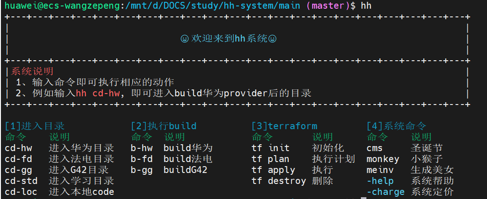

# hh-system使用说明

### 1、获取系统
```git
git clone git@github.com:Zippo-Wang/hh-system.git
```
### 2、编辑环境变量
```bash

# 编辑环境变量
vim /home/huawei/.bashrc

# 填写main.sh所在的路径 和 hh-system所在目录
# 用户需要将`project_path`替换成相应的路径
alias hh="source project_path/main/main.sh"
export hh_project_path="project_path"

# 使环境变量生效
source /home/huawei/.bashrc
```

### 3、示例
首次运行系统，需要执行`hh init`进行初始化
```bash
hh init
hh cms
```


### FAQ
如果初始化失败，先使用vim进入`project_path/main/main.sh`

然后输入`:set ff=unix`

保存退出，再执行`hh init`
