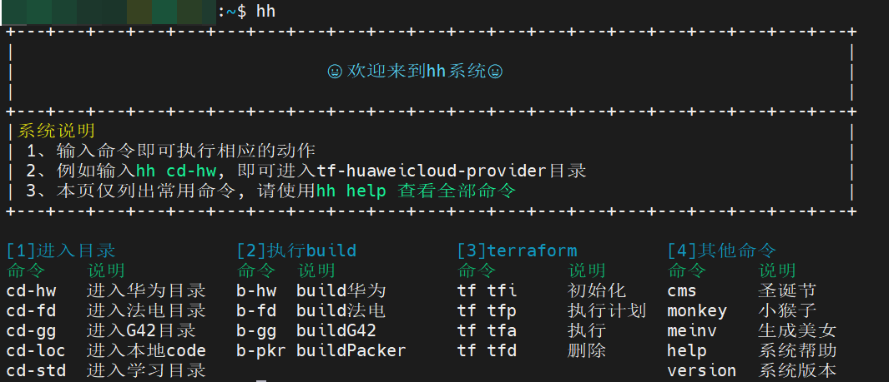

# hh-system使用说明

hh-system适用于Ubuntu, 其它系统没测试过

### 1、获取系统
```git
git clone git@github.com:Zippo-Wang/hh-system.git
```
### 2、编辑环境变量
```bash

# 编辑环境变量
vim /home/huawei/.bashrc

# 第1行`hh_code_path`替换成本地存放代码的目录
# 第2行`hh_study_path`替换成本地学习的目录
# 第3行`hh_project_path`替换成hh-system project所在路径
# 第4行`hh_var_file_name`替换成-var-file后面想跟的那个文件名
# hh_main和alias不用动
export hh_code_path="/mnt/d/xxxxx"
export hh_study_path="/mnt/d/xxxxx"
export hh_project_path="/mnt/d/xxxxx"
export hh_var_file_name="variables.json"
export hh_main="hh"
alias hh="source $hh_project_path/main/main.sh"

# 使环境变量生效
source /home/huawei/.bashrc
```

### 3、系统初始化
```bash
# 首次运行系统, 需要进行初始化
hh init

# 查看系统帮助
hh --help
```

### 4、示例
```bash
# 显示系统主界面
hh
```



```bash
# 先敲hh, 再敲其他命令
hh cms
```


### FAQ

### 1、如果您希望为本系统贡献代码
编写代码之前, 请先为windows设置
```git
git config --global core.autocrlf false
```

提交完PR之后, 改回
```git
git config --global core.autocrlf true
```

### 2、提出建议
如果您有好的建议，请点击[here](https://github.com/Zippo-Wang/hh-system/issues)
